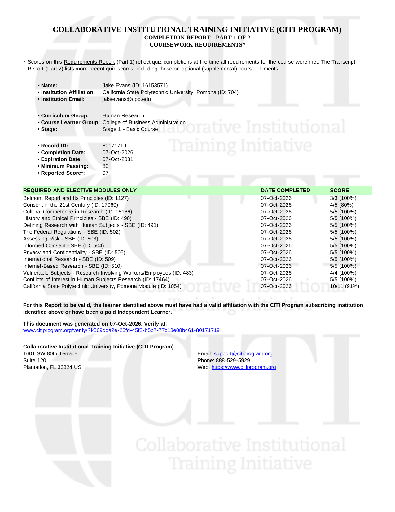
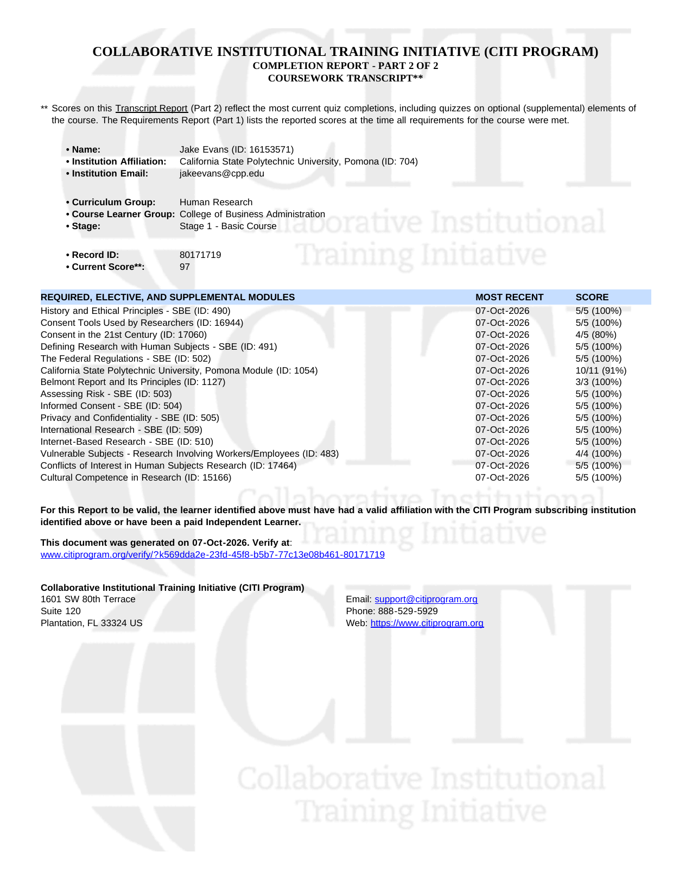

## Overview

This report documents completion of the CITI Program Human Subjects Research training required by Cal Poly Pomona's Institutional Review Board (IRB). I completed the **College of Business Administration** learner group. It includes the CPP Introduction to Human Subjects 101 content plus modules on international research, internet-based research, and research involving workers/employees.

## Certificate

{#fig-citi-1 fig-align="center" width="90%"}

{#fig-citi-2 fig-align="center" width="90%"}

## Completion Summary

| Item | Detail |
|---|---|
| Name | Jake Evans |
| Institution | California State Polytechnic University, Pomona |
| Curriculum Group | Human Research |
| Course Learner Group | College of Business Administration |
| Stage | Stage 1 – Basic Course |
| Record ID | 80171719 |
| Completion Date | October 7, 2026 |
| Expiration Date | October 7, 2031 |
| Minimum Passing Score | 80 |
| Reported Score | **97** |

## Modules Completed

| Module | Score |
|---|---|
| Belmont Report and Its Principles | 3/3 (100%) |
| History and Ethical Principles – SBE | 5/5 (100%) |
| Defining Research with Human Subjects – SBE | 5/5 (100%) |
| The Federal Regulations – SBE | 5/5 (100%) |
| Assessing Risk – SBE | 5/5 (100%) |
| Informed Consent – SBE | 5/5 (100%) |
| Consent in the 21st Century | 4/5 (80%) |
| Privacy and Confidentiality – SBE | 5/5 (100%) |
| International Research – SBE | 5/5 (100%) |
| Internet-Based Research – SBE | 5/5 (100%) |
| Vulnerable Subjects – Research Involving Workers/Employees | 4/4 (100%) |
| Conflicts of Interest in Human Subjects Research | 5/5 (100%) |
| Cultural Competence in Research | 5/5 (100%) |
| California State Polytechnic University, Pomona Module | 10/11 (91%) |

## Appendix

- [Published Report (GitHub Pages)](https://jakevns.github.io/IBM6500/IC8-2_CITI_Certification/Evans_Jake-IC8-2-CITI_Certification.html)
- [GitHub Repository Folder](https://github.com/jakevns/IBM6500/tree/main/IC8-2_CITI_Certification)
- [CITI Certificate Verification](https://www.citiprogram.org/verify/?k569dda2e-23fd-45f8-b5b7-77c13e08b461-80171719)
- [CPP IRB Protocol Page](https://www.cpp.edu/research/research-compliance/irb/protocol.shtml)
- [CITI Program](https://www.citiprogram.org)
