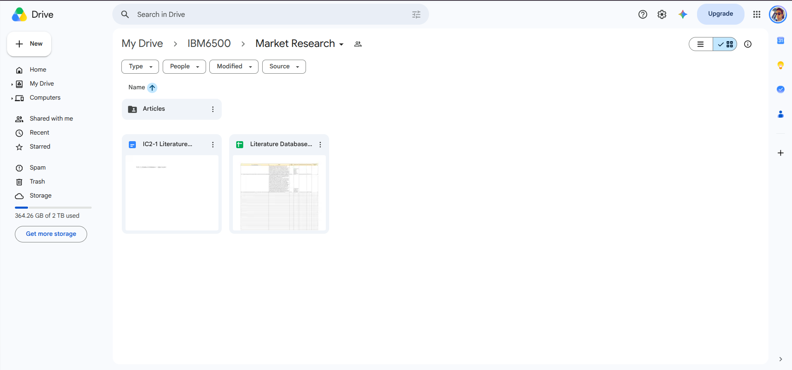
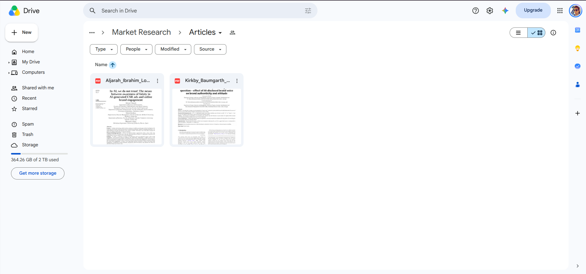
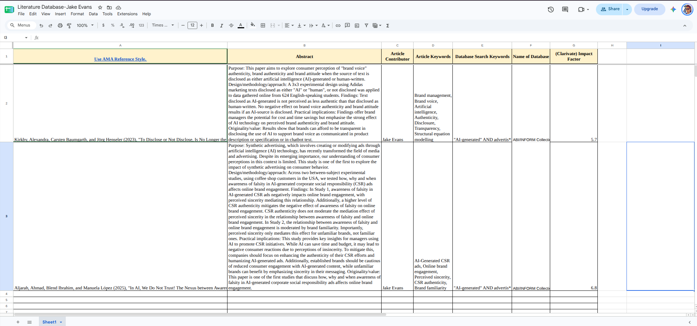

This page documents the organization and completion of my **IC2-1 Literature Database** assignment for IBM 6500. The project materials are organized in Google Drive, while this Quarto page provides a simple record of the database, article folder, and completed file structure.  The link to the Google Drive folder is located in the Appendix at the end of the document. 

# Google Drive Organization

The main **Market Research** folder contains the Literature Database spreadsheet, the IC2-1 submission document, and an **Articles** subfolder for the source PDFs.

{fig-align="center" width="95%"}

# Articles Folder

The **Articles** subfolder contains the two journal articles used for the literature database. The PDFs are stored separately from the spreadsheet so that each database record can be matched to its corresponding source article.

{fig-align="center" width="95%"}

# Literature Database

The Literature Database records the required information for each article, including the AMA/JCR-style reference, abstract, article contributor, article keywords, database search keywords, database name, and Clarivate impact factor.

{fig-align="center" width="98%"}

## Final AMA/JCR References

1.  Kirkby, Alexandra, Carsten Baumgarth, and Jörg Henseler (2023), "To Disclose or Not Disclose, Is No Longer the Question – Effect of AI-Disclosed Brand Voice on Brand Authenticity and Attitude," *Journal of Product & Brand Management*, 32 (7, August), 1108–22.

2.  Aljarah, Ahmad, Blend Ibrahim, and Manuela López (2025), "In AI, We Do Not Trust! The Nexus between Awareness of Falsity in AI-Generated CSR Ads and Online Brand Engagement," *Internet Research*, 35 (3, May), 1406–26.

::: callout-note
## Submission Note

The Google Drive project folder contains the working Literature Database and the **Articles** subfolder. This Quarto document is maintained in the IBM6500 GitHub repository as a reproducible record of the assignment.
:::

# Appendix

## Project Links

The files associated with this assignment are available through the links below.

- **Google Drive Folder:** [IC2-1 Literature Database and Articles](https://drive.google.com/drive/folders/13Y05xLlVNuUFfxfGRm9jHf9J0gYadrgu?usp=drive_link)
- **GitHub Repository:** [IBM6500 – M02](https://github.com/jakevns/IBM6500/tree/main/M02)
- **Published HTML:** [Evans, Jake - IC2-1](https://jakevns.github.io/IBM6500/M02/Evans%2C%20Jake%20-%20IC2-1.html)