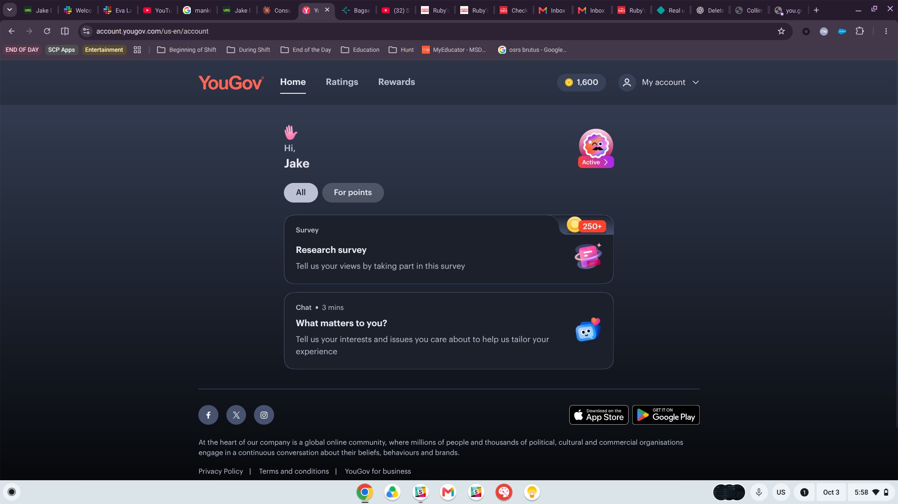
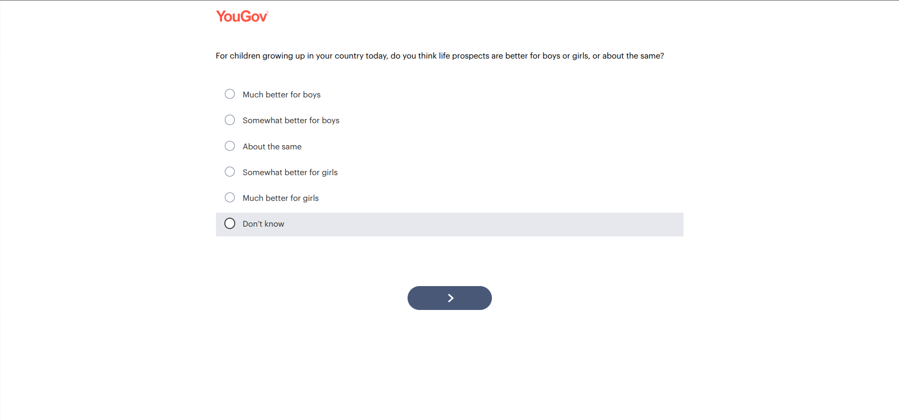
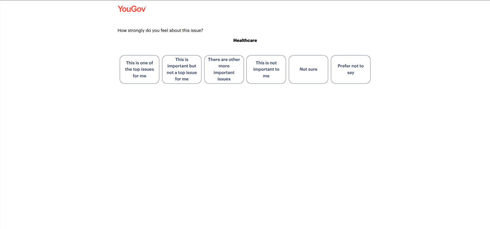
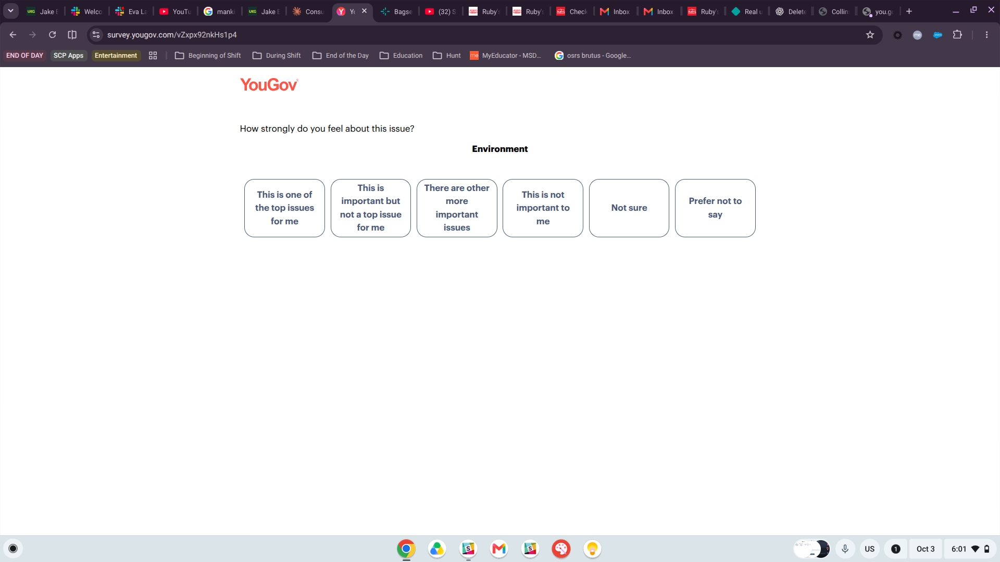
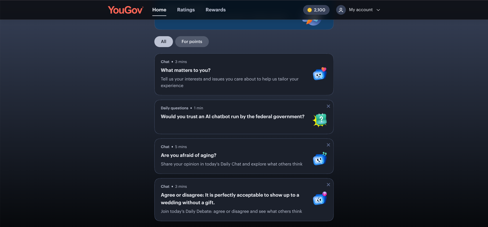

# Introduction

For this assignment I joined **YouGov**, an online consumer panel that rewards members with points for taking surveys. Signing up only asked for basic information like my name, email, age, gender, and ZIP code, and my dashboard filled with activities right away. I completed the "Research survey" that was listed on my dashboard, which increased my balance from 1,600 to 2,100 points.

The goal was to look at the survey from the respondent's point of view and pay attention to any questions that felt strange, confusing, or difficult to answer. Overall, a lot of the questions I received felt random or poorly worded, and several of them were awkward to answer. The sections below show the specific questions I noticed and explain why I chose them.

{#fig-dashboard-start}

# Questions I Found Weird or Confusing

## "Are life prospects better for boys or girls?"

{#fig-q1}

**Why I chose it.** This question came out of nowhere. Nothing before it explained what the survey was about, so suddenly being asked a sensitive question about gender felt random. The bigger problem is the wording. "Life prospects" is never defined. It could mean income, education, safety, career opportunities, health, or something else, and the answer could be different depending on which one a person is thinking about. I had to decide for myself what the phrase meant before I could answer, which means different respondents may be answering different versions of the same question.

The answer scale itself is actually well designed. It is balanced, with "much" and "somewhat" on both sides, a real middle option with "About the same," and a "Don't know" choice. So the problem is not really the scale. The problem is that the main idea being measured is too vague.

## "How strongly do you feel about this issue?"

::: {layout-ncol="1"}
{#fig-q2a}

{#fig-q2b}
:::

**Why I chose it.** This was probably the most awkward question for me to answer. The question asks how *strongly I feel* about an issue, but none of the answer choices actually measure strength of feeling. They measure *importance*, so the question and the answers do not really match.

The answer choices are also difficult to separate from each other. "This is important but not a top issue for me" and "There are other more important issues" feel almost the same, and it is not obvious which one is supposed to be higher or lower. Some choices judge the issue on its own, like "not important to me," while others compare it to other issues, like "other more important issues." Because of that, the choices do not feel like they are all part of one clear scale. They are also shown side by side as buttons instead of in a vertical list, which made the order harder to understand.

The same question was also repeated for one issue after another, such as Healthcare and then Environment. After a few screens, it started to feel repetitive. That seems like the kind of situation where respondents could start choosing the same answer over and over without really thinking about each question.

## Dashboard "chats" and daily questions

{#fig-dashboard-after}

**Why I chose it.** These shorter activities also show some wording problems, even when the question is only one sentence:

- **"Are you afraid of aging?"** The word "afraid" already brings in a negative emotion before the person even answers.
- **"Agree or disagree: It is perfectly acceptable to show up to a wedding without a gift."** Agree or disagree statements can sometimes push people toward agreeing, and the word "perfectly" makes the statement feel too extreme if someone thinks it is acceptable only in certain situations.
- **"Would you trust an AI chatbot run by the federal government?"** Trust it to do what? Trusting it to answer a tax question is very different from trusting it with personal information, and the question does not explain what kind of trust it is asking about.

These questions seem like they are designed to be quick and engaging more than highly precise, which makes sense for keeping panel members active. At the same time, they are good examples of the kinds of wording I would want to avoid in a research survey.

# Lessons Learned for My Research Project

My CEP project, Group 3 for the Collins College of Hospitality Management, includes my analytics objective on which digital channels and content themes generate awareness and inquiry among prospective students. That part of the project includes an IRB approved survey of prospective students, so this experience connects directly to the work I will be doing.

1. **Define every concept in the question.** "Life prospects" showed me how a vague phrase can lead different respondents to answer different versions of the same question. In my survey, terms like "heard about," "social media," or "engaged with" need to be specific. For example, I should name the actual platform, such as Instagram, YouTube, or the college website, instead of only saying "online."

2. **Make the answers match the question.** The "how strongly do you feel" question asked about one thing but gave answers about something else. When I write a survey question, I need to make sure the answer choices are actually measuring what the question is asking.

3. **Use one clear, ordered scale.** The answer choices should be easy to rank and should not overlap. If I ask how influential a channel was, a standard labeled scale such as not at all to extremely influential would be much easier to answer than the mixed choices used in Section 2.2.

4. **Avoid loaded and extreme wording.** Words like "afraid" and "perfectly" can influence how a respondent reacts to a question. My survey questions should stay as neutral as possible so the answers reflect what prospective students actually think instead of how the question was phrased.

5. **Keep it short and give context.** The random topic changes and repeated questions made the survey feel longer and more confusing than it needed to be. Grouping related questions together, telling respondents what each section is about, and limiting repeated grids should help reduce fatigue and straight lining.

6. **Remember the limits of self report.** It was harder than I expected to answer some questions about my own opinions consistently. This supports what I found in my evidence review, where what people say about where they saw something does not always match their actual behavior. For my project, GA4 and platform data should be the main evidence, while the survey should help explain *why* students respond to certain channels and content.

7. **Pre test the survey.** Most of these problems probably would have been noticed quickly if a few people had taken the survey first and explained where they got confused. Before launching my own survey, I plan to have classmates or current Collins students test it and point out anything that feels unclear.

# Conclusion

Taking a survey as a panel member made it really obvious how much small wording choices can affect the experience. Questions that probably seemed fine to the person who wrote them felt random or awkward from the respondent's side. The biggest takeaway for my CEP survey is that I need to think about the questions from the respondent's point of view by using clear terms, making sure the answers match the question, keeping the wording neutral, and testing the survey before it goes live.

# Appendix 

## Required Links

- **GitHub repository:** <https://github.com/jakevns/IBM6500>
- **M05 assignment folder:** <https://github.com/jakevns/IBM6500/tree/main/M05>
- **Quarto source file (.qmd):** <https://github.com/jakevns/IBM6500/blob/main/M05/Evans_Jake-M05-IC5-2-Consumer-Panel.qmd>
- **Published report (GitHub Pages):** <https://jakevns.github.io/IBM6500/M05/Evans_Jake-M05-IC5-2-Consumer-Panel.html>
- **Screenshots folder:** <https://github.com/jakevns/IBM6500/tree/main/M05/images>

## Consumer Panel Used

- **YouGov (US panel sign-up):** <https://account.yougov.com/us-en/join/main>
- **Surveys completed:** YouGov "Research survey" (topic not shown before starting), October 3, 2026

## Screenshot Index

| Figure | File | Description |
|:--|:--|:--|
| @fig-dashboard-start | `images/yougov-dashboard-start.png` | Dashboard before the survey (1,600 points) |
| @fig-q1 | `images/q1-life-prospects.png` | Life prospects for boys vs. girls |
| @fig-q2a | `images/q2-healthcare.png` | Issue importance: Healthcare |
| @fig-q2b | `images/q2-environment.png` | Issue importance: Environment |
| @fig-dashboard-after | `images/yougov-dashboard-after.png` | Dashboard chats and daily questions (2,100 points) |

: Screenshots included in this report {#tbl-screenshots}

## Reference

- Dollar Break. *Surveys for Money – Is YouGov Legit & Worth It? (Tested App Review)* [Video]. YouTube.
