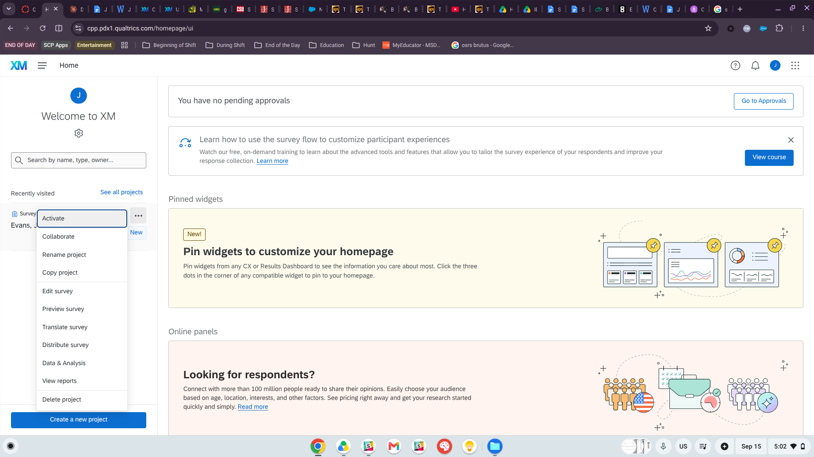
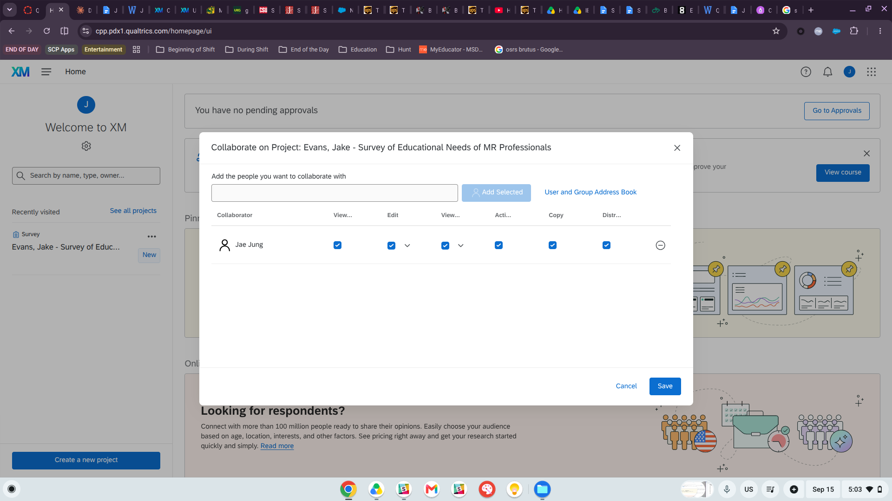
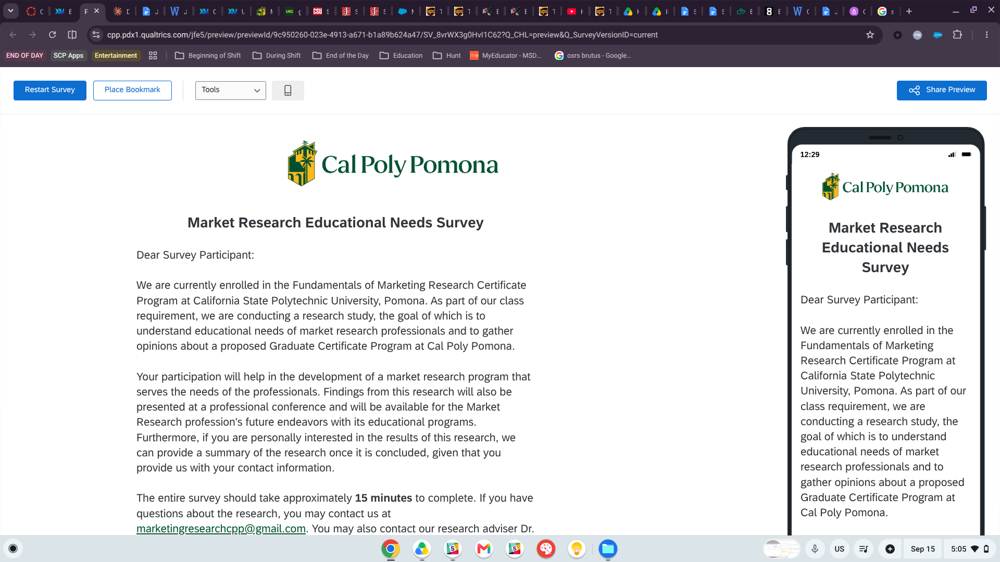
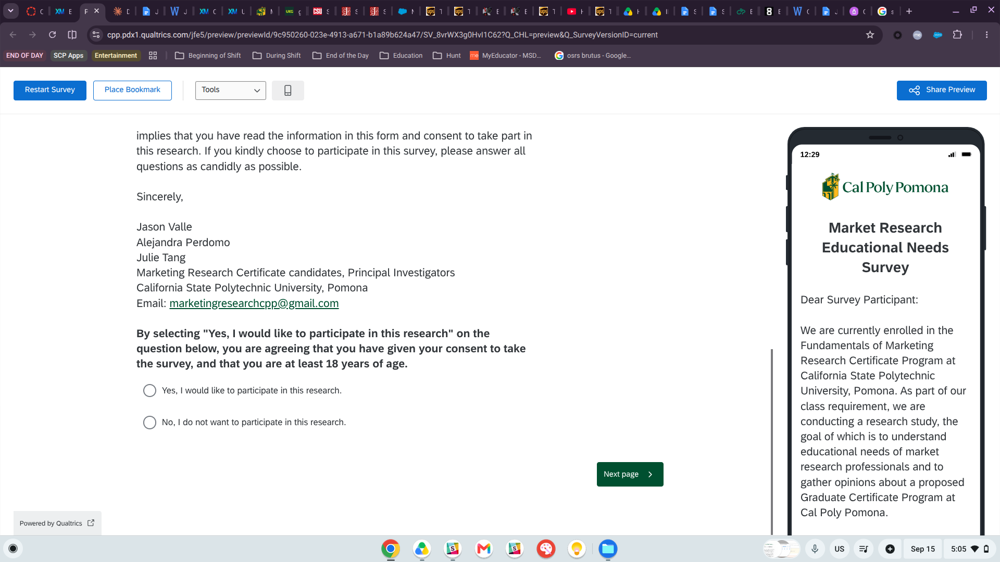
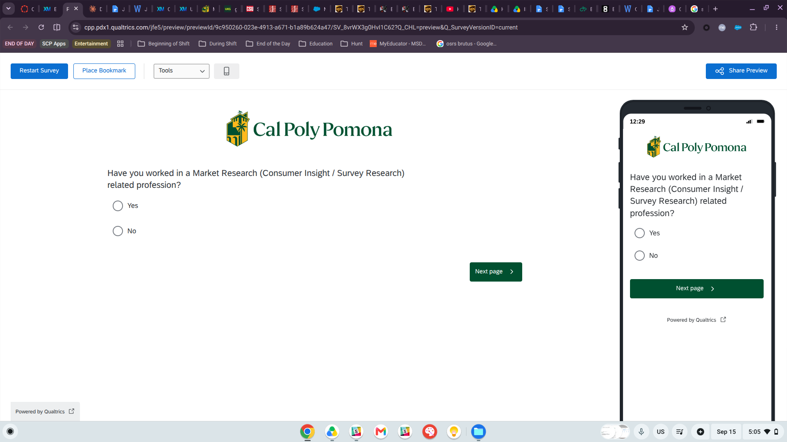
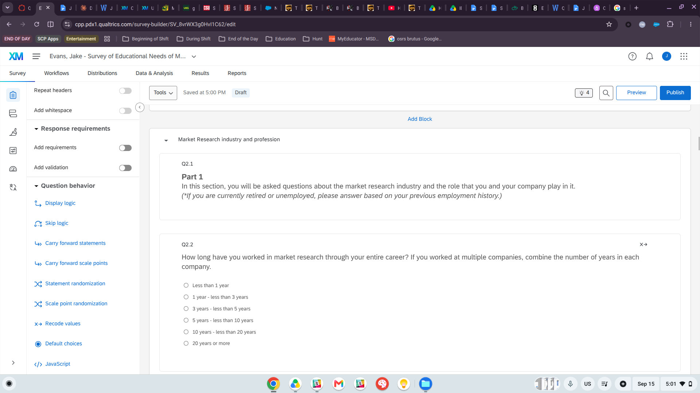
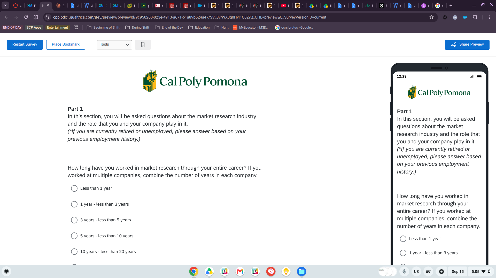
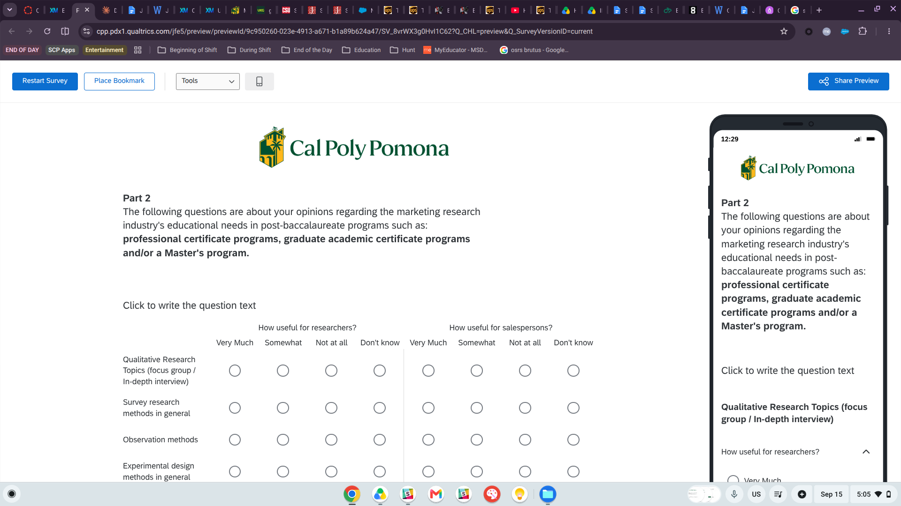

# Overview

For Qualtrics Assignment #1, I am converting the Word version of the *Survey of Educational Needs for MR Professionals* into a Qualtrics survey. This report documents the rough draft completed for Qualtrics M01-1.

I created the project in my Cal Poly Pomona CBA Qualtrics account (upgraded with the CBA student code), named it **"Evans, Jake - Survey of Educational Needs of MR Professionals,"** and shared it with Dr. Jae Jung. The screenshots below show proof of sharing and the beginning, middle, and ending areas of the survey built so far.

# 1. Proof of Sharing the Survey

From the My Projects page, I opened the project menu and selected **Collaborate** (this version of Qualtrics' "Share Project" option).

{width=90%}

I added Dr. Jae Jung (Bronco ID: jmjung) as a collaborator and granted all permissions: View, Edit, View Results, Activate, Copy, and Distribute.

{width=90%}

# 2. Beginning of the Survey — Cover Page Block

The **Cover page** block contains two questions. Q1.1 combines the survey title, the introductory letter (broken into separate paragraphs for readability), and the consent question. Q1.2 screens for market research experience.

{width=90%}

The consent choices use recode values of 1 (Yes) and 2 (No). Skip logic sends participants who select "No" to the end of the survey.

{width=90%}

Q1.2 uses the same recode values and skip logic, ending the survey for participants without market research experience.

{width=90%}

# 3. Middle of the Survey — Market Research Industry and Profession Block

The second block covers Q2.1 through Q2.11. Block numbering is applied, so question numbers are tied to blocks and do not appear in the question text. Recode values are set behind the scenes rather than typed into the answer choices.

{width=90%}

{width=90%}

# 4. Ending of the Draft — Educational Needs Block

The third block begins with the Part 2 introduction (Q3.1). Q3.2 uses a **Side by Side** question so participants rate each method separately for researchers and salespersons.

{width=90%}

# 5. Progress Notes

**Completed so far:**

- Created and upgraded a CPP CBA Qualtrics account
- Created and named the project
- Shared the project with Dr. Jung with full permissions
- Built the Cover page, Market Research industry and profession, and Educational Needs blocks
- Applied recode values, skip logic on Q1.1 and Q1.2, a dropdown list for Q2.4, number validation for Q2.8, and a side-by-side format for Q3.2

**Remaining for Qualtrics Assignment #1:**

- Build the GCMR Program (Q4.1–Q4.15) and Demographics (Q5.1–Q5.15) blocks
- Add remaining display logic, reverse coding, and "Don't know" exclusions
- Create a class folder and move the project into it
- Review the full survey in Preview against the final checklist

# Appendix

- **GitHub Repository:** <https://github.com/jakevns/IBM6500/tree/main/M05>
- **GitHub Pages:** <https://jakevns.github.io/IBM6500/M05/Evans_Jake-Qualtrics-M01-1-Designing_a_Survey.html>