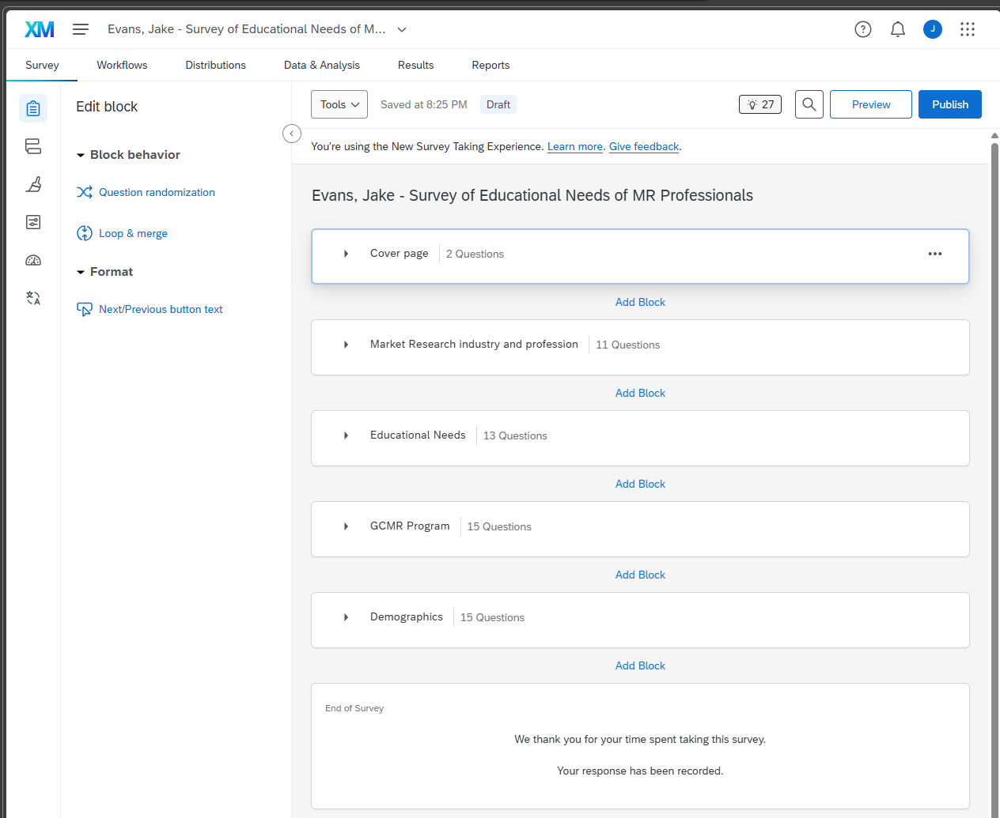
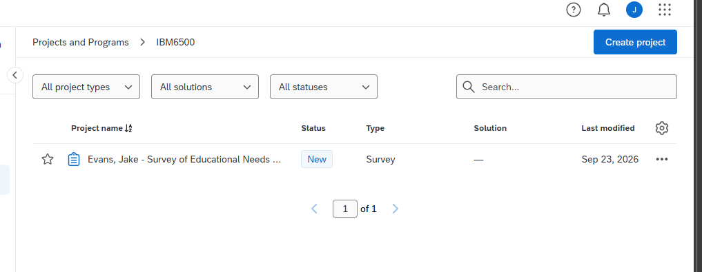

# Overview

For Qualtrics Assignment #1, I converted the Word version of the *Survey of Educational Needs for MR Professionals* into a complete Qualtrics survey. I created the project using my Cal Poly Pomona CBA Qualtrics account and named it **“Evans, Jake - Survey of Educational Needs of MR Professionals.”** I also organized the survey into a class folder and shared it with Dr. Jae Jung.

The completed survey includes **56 questions across five blocks**, following the structure provided in the assignment instructions.

| Block                                   | Questions |
|-----------------------------------------|-----------|
| Cover page                              | 2         |
| Market Research industry and profession | 11        |
| Educational Needs                       | 13        |
| GCMR Program                            | 15        |
| Demographics                            | 15        |
| **Total**                               | **56**    |

# 1. Main Page of the Qualtrics Survey

The screenshot below shows the survey's main page with all five blocks and their question counts.

{width="95%"}

# 2. Proof of Sharing the Survey

I shared the survey with Dr. Jae Jung (Bronco user ID: jmjung) and gave him full collaborator permissions, including View, Edit, View Results, Activate, Copy, and Distribute. This allows him to open the survey directly and review it for grading.

{width=90%}

# 3. Class Folder

I placed the project in a class folder named **IBM6500** on the My Projects page instead of leaving it under Uncategorized.

{width="90%"}

# 4. Functions Implemented

I added the following Qualtrics functions to match the logic and coding shown in the original Word version of the survey.

## Question Formats

* **Text/Graphic** was used for the section introductions (Q2.1, Q3.1, Q4.1) and the GCMR program description (Q4.2). The program description was separated into paragraphs, with course titles bolded to make it easier to read.
* **Dropdown lists** were used for Q2.4 (primary industry) and Q5.11 (state of residence).
* **Text entry with content validation** was used for Q2.8, which requires a numeric response for years of employment, and Q5.15, which checks for a valid email address format.
* **Essay boxes** were used for the open-ended feedback questions Q4.14, Q4.15, and Q5.14.
* **Side by Side** formatting was used for Q3.2 through Q3.5 so respondents could provide separate ratings for researchers and salespersons.
* **Matrix tables** were used for the Likert-scale questions Q2.11, Q3.13, Q4.3, Q4.4, Q4.9, and Q4.10.
* **Text entry fields for “Other” responses** were added wherever the original Word version included a fill-in line.

## Coding

* Recode values were added in the background rather than typed directly into the answer choices, so respondents do not see the numeric codes.
* **Reverse coding** was used where the original Word version listed response scales from highest to lowest. This keeps the highest level or magnitude connected to the highest numeric value for Q2.11, Q3.2–Q3.5, Q4.5–Q4.8, and Q4.10.
* **“Don’t know” / “I don’t know” responses were excluded from analysis** for Q2.11, Q3.2–Q3.5, Q3.7, Q3.9, and Q4.12, while still remaining available as response options for participants.
* **Block numbering** was used for automatic question numbering, so question numbers stay connected to their section and do not need to be typed into the question text.

## Logic

* **Skip logic** was added to Q1.1 and Q1.2 so participants who do not consent or do not have market research experience are taken directly to the end of the survey.
* **Display logic** was added to show certain questions only when they are relevant to the respondent. Q3.7 and Q3.9 appear only when a Master’s Degree is selected, Q4.9 appears only when enrollment is rated as unlikely, Q5.6 through Q5.8 depend on the respondent’s highest level of education, and Q5.12 and Q5.13 depend on the respondent’s state and California region.

# 5. Notes and Remaining Refinements

This section can be used to explain any formatting decisions, items that were intentionally left unchanged from the original survey, or any questions that still need clarification before the survey is finalized.

# Appendix

- **GitHub Repository:** <https://github.com/jakevns/IBM6500/tree/main/M06>
- **GitHub Pages:** <https://jakevns.github.io/IBM6500/M06/Evans_Jake-Qualtrics-Assignment-1-MR-Educational-Needs-Survey.html>
