# Overview

For Qualtrics Assignment #2, I imported the provided `.qsf` file into my Cal Poly Pomona CBA Qualtrics account and named the project **"Social Media Opinion Leader Experimental Design."** I then completed the three tasks from Step 5:

1.  I set up a **between subjects experiment** in the Survey Flow so each participant only sees one of the two ad types, either the social media review or the ad, using the **Randomizer** and **Branch** functions.
2.  I fixed **Q2.2** so it measures usage time for **each** social media platform separately using the **Carry Forward** function.
3.  I made **three additional improvements** to the questionnaire.

# Task 1. Random Assignment in the Survey Flow

## Complete Survey Flow

The screenshot below shows the full Survey Flow after my changes, starting with the `id` embedded data field at the top and ending with the Demographics block at the bottom. 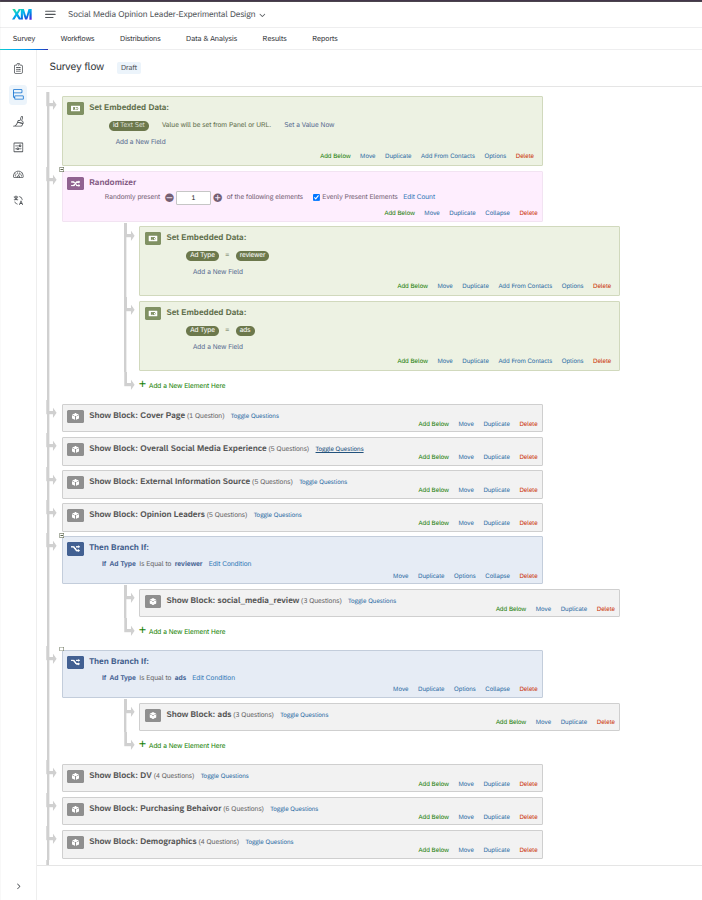{width="80%"}

The flow works in this order:

| Order | Element | Purpose |
|----|----|----|
| 1 | Set Embedded Data: `id` | Gives each participant an ID when they enter the survey |
| 2 | **Randomizer** (present 1, evenly) | Randomly assigns each participant to `Ad Type = reviewer` or `Ad Type = ads` |
| 3–6 | Cover Page → Overall Social Media Experience → External Information Source → Opinion Leaders | Shown to everyone |
| 7 | **Branch: Ad Type = reviewer** → social_media_review | Only participants in the review group see the review video |
| 8 | **Branch: Ad Type = ads** → ads | Only participants in the ad group see the ad video |
| 9–11 | DV → Purchasing Behavior → Demographics | Shown to everyone once, no matter which ad type they received |

## Randomizer

I placed the Randomizer directly after the `id` field so participants are assigned to a condition as early as possible. Inside the Randomizer are two Set Embedded Data elements that create the field **Ad Type** with the values `reviewer` and `ads`.

The Randomizer is set to **randomly present 1** of those elements, and **Evenly Present Elements** is checked. This means each participant is assigned to only one condition, while also keeping the two groups as close to equal in size as possible.

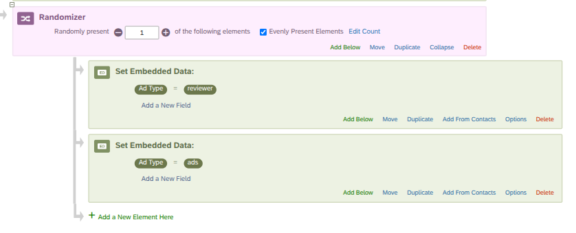{width="85%"}

## Branches

After the Opinion Leaders block, there are two Branch elements that check the participant's **Ad Type** value. The `social_media_review` block is only shown inside the `reviewer` branch, while the `ads` block is only shown inside the `ads` branch.

Neither ad block appears anywhere else in the Survey Flow. The DV block comes after both branches and is not placed inside either one. This makes sure every participant answers the same dependent variable questions once, no matter which ad condition they were assigned to.

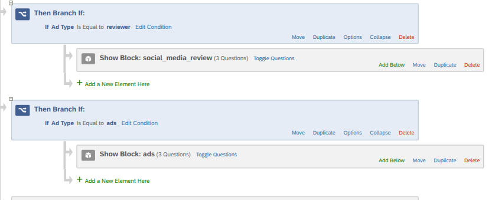{width="85%"}

## Testing the Random Assignment

I previewed the survey several times to confirm the random assignment works. The Randomizer's element counts show both conditions were assigned an almost equal number of times (4 and 5).

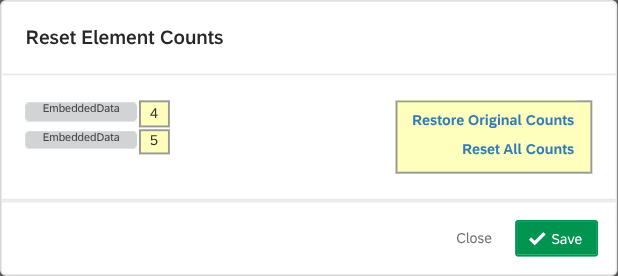{width="60%"}

Different preview runs landed in different conditions:

::: {layout-ncol="2"}
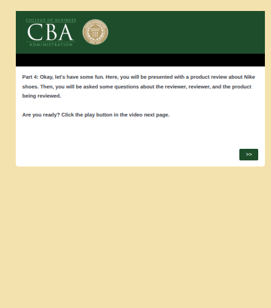

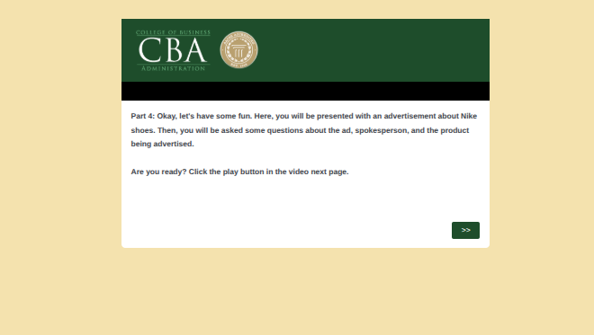
:::

# Task 2. Capturing Usage Time for Each Social Media Platform

## The Problem with the Original Q2.2

The original Q2.2 asked how often people use social media platforms **as a whole**. Since most people use more than one platform, this does not really show how much time they spend on each individual platform. The answer choices also had some overlap and gaps. For example, "1 hour or less" overlaps with "1 to 2 hours," while there is nothing that clearly covers 2 to 3 hours.

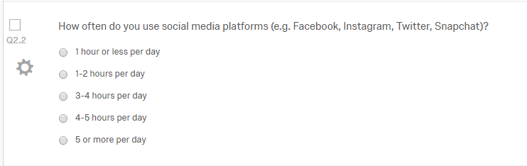{width="80%"}

## Step 1: Ask Which Platforms Participants Use

I added a new question before Q2.2 that asks: *"Which of the following social media platforms do you use? Please select all that apply."* I set the answer type to **Allow multiple answers** so participants can select every platform they use instead of being forced to choose only one.

I also updated "Twitter" to "X (formerly Twitter)," added TikTok and YouTube, and included an "Other" option with a text entry box.

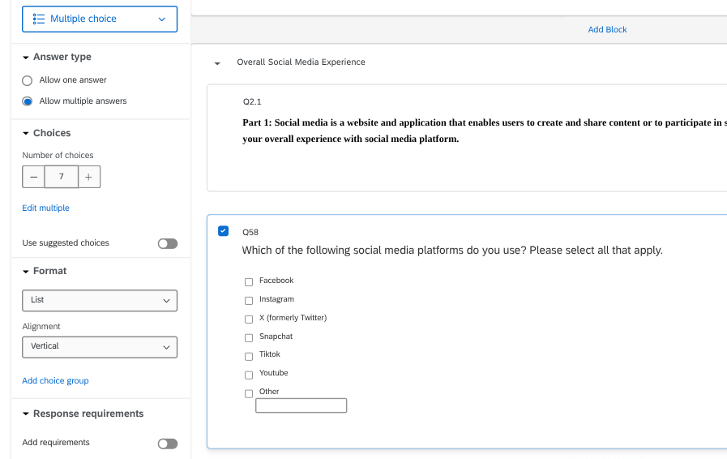{width="85%"}

## Step 2: Carry Forward the Selected Platforms into Q2.2

I changed Q2.2 to a **Matrix table** and used **Carry forward statements** from the platform question with **Selected Choices**. This means every platform the participant selected becomes its own row, so their usage time is recorded separately for each one.

I also replaced the original answer choices with ranges that do not overlap: *Less than 1 hour / 1 to less than 2 hours / 2 to less than 3 hours / 3 to less than 4 hours / 4 hours or more*. I added a **page break** between the two questions so the carry forward can pull in the selections from the previous page.

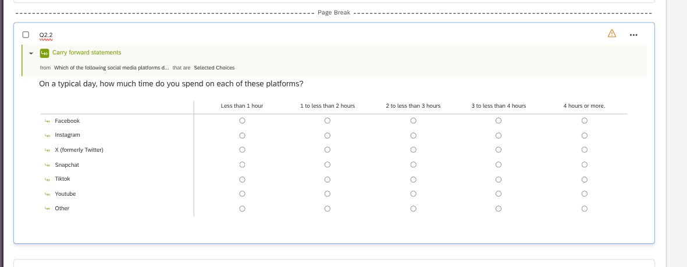{width="95%"}

## Testing the Carry Forward

In preview, I selected three platforms. Q2.2 then showed only those three platforms as rows.

::: {layout-ncol="2"}
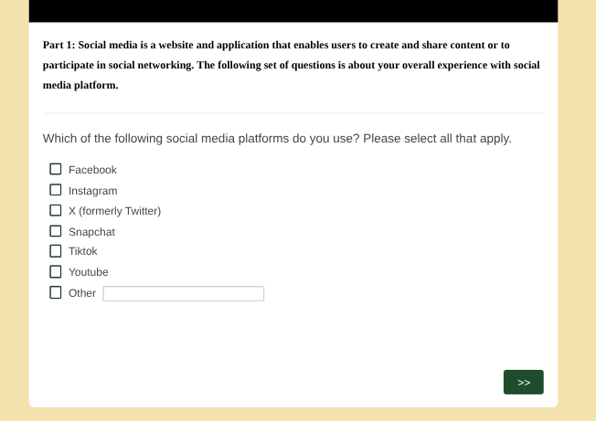

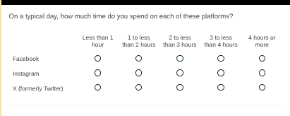
:::

# Task 3. Additional Improvements

## Improvement 1: Replaced the Broken Review Video

**Problem:** When I previewed the review condition, the YouTube video in the `social_media_review` block showed *"Video unavailable. This video is private."* This meant participants assigned to that condition would not actually see the treatment, which would create a major problem for the experiment.

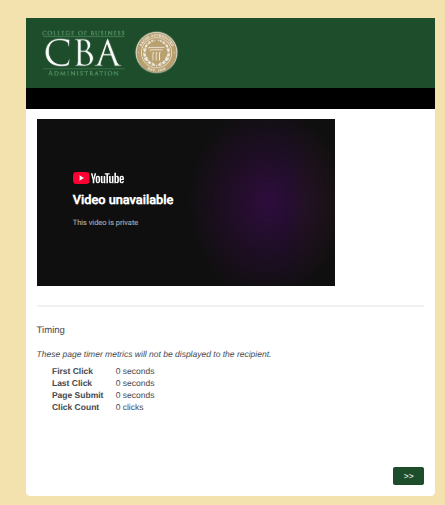{width="55%"}

**Fix:** I replaced it with a working Nike shoe review video, using YouTube's `/embed/` link so it plays inside the survey.

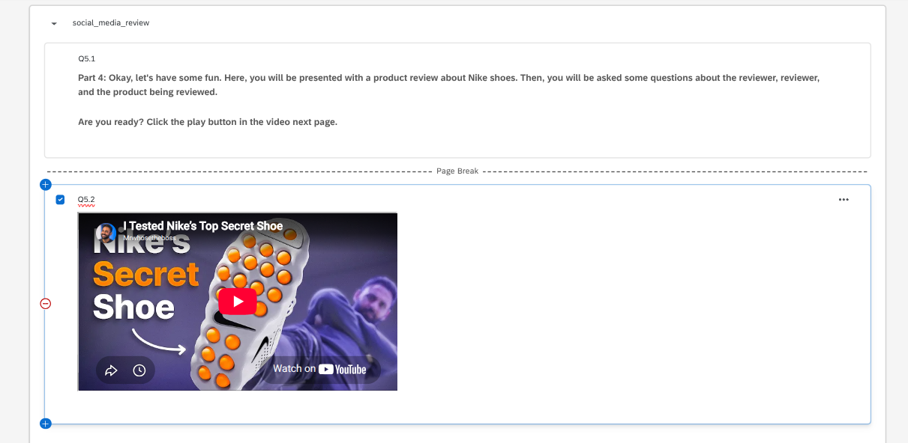{width="85%"}

**Why it's better:** The experiment only works if participants are actually able to see the treatment. Replacing the broken video makes sure the review group can be compared to the ad group the way the experiment was designed.

## Improvement 2: Made the Q2.2 Matrix Mobile Friendly

**Problem:** Qualtrics flagged the survey as not being optimized for mobile. Since Q2.2 is now a five column matrix, it can be difficult to read and answer on a phone screen.

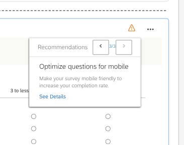{width="45%"}

**Fix:** I turned on **Mobile friendly** in Q2.2's Format settings. On a phone, the matrix is shown one platform at a time instead of as a wide grid.

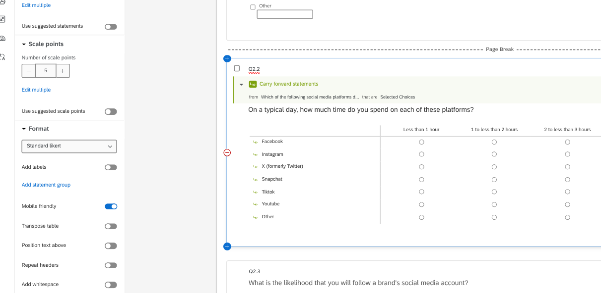{width="85%"}

**Why it's better:** A survey about social media will probably be completed on a phone by a lot of participants. Wide matrix questions can be harder to read on a smaller screen, which can lead to skipped rows, careless responses, or people leaving the survey before finishing.

## Improvement 3: Added "Prefer not to answer" to Sensitive Demographic Questions

**Problem:** Questions about sex and ethnicity can feel more sensitive to some participants. Without an option to skip the question, they may either leave the survey or choose an answer that does not accurately represent them.

**Fix:** I added **"Prefer not to answer"** to Q9.3 (sex) and Q9.4 (ethnicity) and set that choice to **Exclude from analysis**, which is shown by the ⃠ icon. This keeps those responses from being included in the percentages in the results.

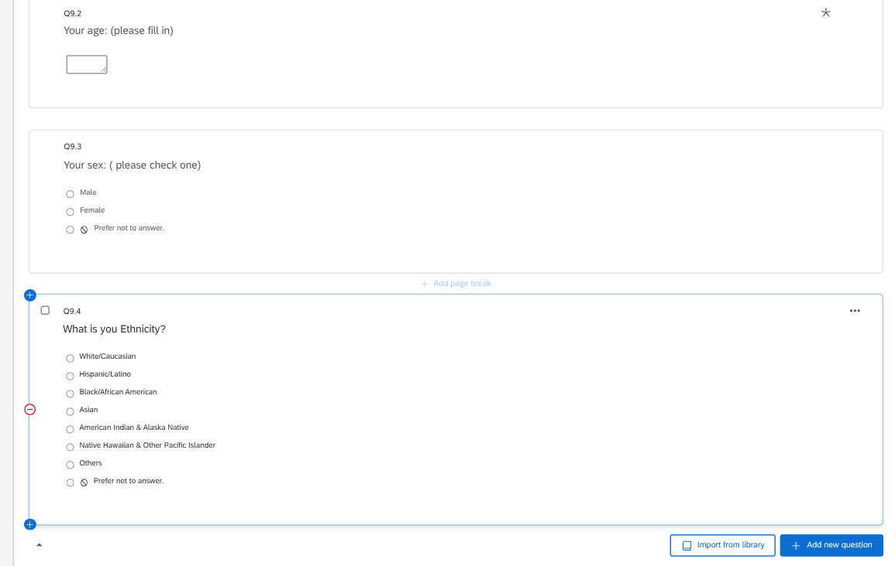{width="85%"}

**Why it's better:** Participants can respect their own privacy and still finish the survey, and the data stays clean because opt-outs are not counted as real answers.

# Appendix

- **GitHub Repository:** <https://github.com/jakevns/IBM6500/tree/main/M06>
- **GitHub Pages:** <https://jakevns.github.io/IBM6500/M06/Evans_Jake-Qualtrics-Assignment-2-Social-Media-Opinion-Leader-Experimental-Design.html>
