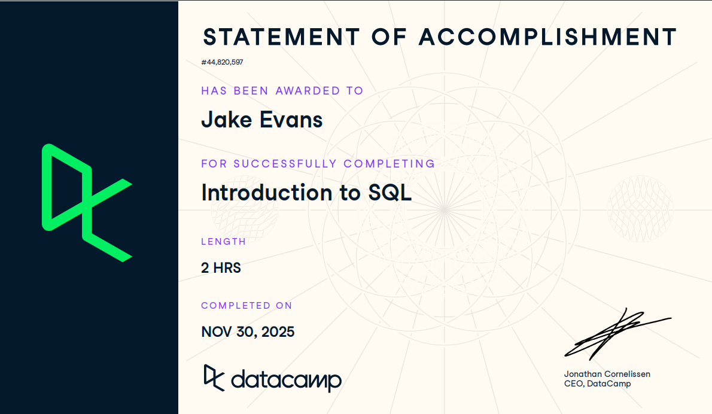

**Student:** Jake Evans  
**Course:** IBM 6500 – Customer Insight Methods and Survey Research  
**Instructor:** Dr. Jae Min Jung

# Course-Completion Evidence

<!-- PLACEHOLDER: paste the certificate screenshot here in the Visual Editor, or keep this line and save the image as images/introduction-to-bigquery-certificate.png -->
{fig-alt="DataCamp certificate showing Jake Evans completed Introduction to BigQuery"}

I completed the Introduction to BigQuery course in the IBM 6500 DataCamp classroom on **[COMPLETION DATE]**. The certificate above shows my name and the course title as proof that I completed the course.

# Learning Notes and Key Takeaways

## Introduction to BigQuery

**Main ideas:** BigQuery is Google Cloud's enterprise data warehouse. If I know how to write SQL, I can use it to query terabytes or even petabytes of data without having to manage the servers myself. Two things make BigQuery different from a normal database: it is **serverless**, meaning Google decides how much computing power a query needs, and it **separates compute from storage**, so I only use the processing power I actually need.

**BigQuery terminology:**

- **OLAP (Online Analytical Processing):** systems designed for reading and summarizing large amounts of data. BigQuery is an OLAP system.
- **OLTP (Online Transaction Processing):** systems designed for lots of smaller inserts, updates, and deletes, such as MySQL or PostgreSQL. Compute and storage are connected, and queries are not distributed the same way they are in BigQuery.
- **Snowflake:** a competing data warehouse that can run on Google Cloud, AWS, or Azure and is commonly used for dynamic BI querying. BigQuery only runs on Google Cloud.
- **Redshift:** Amazon's data warehouse, which supports real time dashboards. BigQuery is more focused on scheduled analytical reporting.

**Best use cases:** scheduled reports, such as a daily sales report, periodic complex analysis, such as quarterly reports, and ad hoc discovery, such as marketing analytics.

**Example:**

```sql
SELECT *
FROM ecommerce.ecomm_order_details
LIMIT 3;
```

**Explanation:** This returns the first three rows from the order details table. `ecommerce` is the course dataset and `ecomm_order_details` is one of the tables inside it. It also shows that standard SQL works in BigQuery, and `LIMIT` is an easy way to quickly preview a table before writing a larger query.

**CEP application:** My AO4 work compares which digital channels drive awareness and inquiry before and after a campaign. That is a type of periodic analytical reporting, which is exactly the kind of work BigQuery is designed for.

## BigQuery Architecture

**Main ideas:** BigQuery is fast because several Google systems work together, with each one handling a different job. The data is stored by column instead of by row, so a query only has to read the columns that it actually uses.

**BigQuery terminology:**

| Component | What it does | Category |
|---|---|---|
| **Capacitor** | Columnar file format where each column is stored separately and compressed; also supports nested and repeated fields | Storage |
| **Colossus** | Google's distributed file system that handles replication and recovery | Storage |
| **Jupiter** | The network that moves data between storage and compute | Compute |
| **Borg** | Cluster manager that assigns computing resources and works around failures | Compute |
| **Dremel** | The query engine that breaks a query into smaller pieces and runs them in parallel | Query execution |

**Query execution tree:** A query starts at the **root node**, which sends work to **mixers**. The mixers then send the work to **leaf nodes**, which read the data, filter it, and aggregate it. The results then move back up to the root. BigQuery assigns **slots**, which are units of computing power, based on how complex the query is.

**Example:** The architecture diagram from top to bottom is Dremel → Jupiter → Capacitor → Colossus.

**Explanation:** This order follows a query from the query engine, across the network, into the file format, and finally down to the file system. It also helps explain why `SELECT *` can be expensive. Since the data is stored by column, selecting everything means BigQuery has to read every column.

**CEP application:** GA4 data has a row for every event, so the amount of data can grow very quickly. Selecting only the columns I actually need will help keep my campaign queries faster.

## BigQuery Data Organization

**Main ideas:** BigQuery organizes data in a hierarchy of **project → dataset → table**, which is why a full table name can contain three parts.

**BigQuery terminology:**

- **Project:** the main Google Cloud container that controls users and permissions.
- **Dataset:** similar to a schema in other databases. It holds tables and can also have its own permissions.
- **Table:** where the actual data is stored.
- **Region:** the physical data center location. BigQuery also has US and EU multi regions. A dataset's region cannot be changed after it is created, and one query cannot read data from two different regions.

**Important SQL syntax:**

```sql
-- Full name: project.dataset.table
SELECT seller_city
FROM `my-project.ecommerce.ecomm_sellers`;

-- Short name when the query runs in the default project
SELECT DISTINCT seller_city
FROM ecommerce.ecomm_sellers;
```

**Explanation:** In the first query, `my-project` is just a placeholder for a Google Cloud project ID. The second query lists each seller city once and can use the shorter table name because the course runs inside a default project.

**CEP application:** If GA4 data and survey data are both stored in BigQuery, the datasets need to be in the same region if I want to join them together in one query.

## Writing Queries in BigQuery

**Main ideas:** BigQuery uses **GoogleSQL**. Most of the main SQL commands work the same way, but some function names and data types are different. For example, BigQuery uses 64 bit numeric types such as `INT64` and `FLOAT64`.

**BigQuery procedures:** Queries can be run in **BigQuery Studio** through the Google Cloud console, through client libraries, with command line tools, or from Python with pandas.

**Important SQL syntax:** `USING (column)` joins two tables when the key column has the same name in both. `ON a.col = b.col` is used when the column names are different.

**Example:**

```sql
SELECT
  ecomm_orders.order_id,
  ecomm_orders.order_items,
  ecomm_order_details.order_status,
  ecomm_order_details.order_purchase_timestamp
FROM ecommerce.ecomm_orders
JOIN ecommerce.ecomm_order_details USING (order_id)
ORDER BY order_purchase_timestamp DESC
LIMIT 10;
```

**Explanation:** This joins the orders table to the order details table using `order_id` and then shows the ten most recent orders. `USING` works here because both tables have a column called `order_id`.

**CEP application:** Joining tables using a shared ID is how I could connect campaign data to inquiry data for AO4.

## Data Ingestion in BigQuery

**Main ideas:** The course covers three ways to batch load data into BigQuery.

**BigQuery procedures:**

1. **BigQuery Studio:** choose a file from my computer or Google Cloud Storage, select the target project, dataset, and table, and either define the schema myself or let BigQuery detect it automatically.
2. **`bq` command line tool:** loads local files or Cloud Storage files using options like `--source_format=CSV` and `--autodetect`.
3. **`LOAD DATA` in SQL:** loads files from Cloud Storage only.

Supported formats are Avro, CSV, JSON, ORC, and Parquet. Local files have to be under 100 MB, and `LOAD DATA` cannot be used to load a local file.

**Important SQL syntax:**

```sql
LOAD DATA INTO dataset.table
FROM FILES (
  uris = ['gs://bucket/path/file.csv'],
  format = 'CSV',
  skip_leading_rows = 1
);
```

**Explanation:** `dataset.table` is a placeholder for the table where the data will go, and `gs://bucket/path/file.csv` is a placeholder for where the file is stored in Cloud Storage. `skip_leading_rows = 1` tells BigQuery to skip the header row in the CSV.

**CEP application:** Survey results exported from Qualtrics as a CSV could be uploaded through BigQuery Studio so they can be analyzed alongside the rest of the CEP data.

## Date/Time Types in BigQuery

**Main ideas:** Dates let me filter large tables, pull out parts like the month or weekday, and partition tables so queries can run faster.

**BigQuery terminology:**

| Type | Holds |
|---|---|
| `DATE` | Year, month, day |
| `TIME` | Time of day only |
| `DATETIME` | Date and time, no time zone |
| `TIMESTAMP` | An absolute point in time; defaults to UTC |

**Important SQL syntax:**

- `DATE_ADD`, `DATE_SUB`, `TIMESTAMP_ADD`, `TIMESTAMP_SUB` with `INTERVAL n PART` (for example, `INTERVAL 7 DAY`)
- `DATE_DIFF` and `TIMESTAMP_DIFF` find the difference between two dates or times
- `EXTRACT(PART FROM value)` pulls out a part such as `DATE`, `MONTH`, `QUARTER`, or `YEAR`
- `FORMAT_DATE` and `FORMAT_TIMESTAMP` change how a date is displayed, such as `'%D'` for MM/DD/YY
- `CURRENT_DATE()` and `CURRENT_TIMESTAMP()`

**Example:**

```sql
SELECT COUNT(order_id)
FROM ecommerce.ecomm_order_details
WHERE order_purchase_timestamp BETWEEN
  TIMESTAMP_SUB(TIMESTAMP('2017-11-24'), INTERVAL 3 DAY)
  AND TIMESTAMP_ADD(TIMESTAMP('2017-11-24'), INTERVAL 3 DAY);
```

**Explanation:** This counts the orders placed during the period from three days before Black Friday 2017 through three days after.

**CEP application:** I could use the same type of query to compare inquiry activity in the days before and after a campaign post.

## Unstructured Data

**Main ideas:** BigQuery can handle rows that contain lists or nested records by using two main data types.

**BigQuery terminology:**

- **ARRAY:** an ordered list. Positions start at zero.
- **STRUCT:** a group of named fields that can be accessed using dot notation, such as `items.price`.
- An ARRAY can contain STRUCTs, which is how `order_items` can store several items inside one order.

**Important SQL syntax:**

- `ARRAY_LENGTH(arr)` counts the elements
- `ARRAY_CONCAT(a, b)` combines arrays
- `UNNEST(arr)` turns each array element into its own row
- `SEARCH(column, 'term')` returns TRUE or FALSE depending on whether a term appears in the column

**Example:**

```sql
SELECT
  order_id,
  items.price
FROM ecommerce.ecomm_orders,
  UNNEST(order_items) items
WHERE order_id = 'a0e747c954a595b0e3458c87ab1a4958';
```

**Explanation:** `UNNEST` takes the `order_items` array and turns each item into its own row. Dot notation is then used to pull the `price` field from each item.

**CEP application:** GA4 stores event details such as the page URL inside nested arrays, so `UNNEST` is how I would pull that information out to see which pages and channels are leading to inquiries.

## Common Table Expressions

**Main ideas:** A CTE is a temporary result set with a name that is created using `WITH` at the beginning of a query. It only exists inside that query. CTEs make longer queries easier to read because I can break them into smaller steps instead of putting everything inside nested subqueries.

**Important SQL syntax:**

- `WITH` is written once, and additional CTEs are separated by commas.
- A later CTE can use an earlier CTE.
- CTEs can be used to filter early, calculate aggregates, and organize joins.

**Example:**

```sql
WITH orders AS (
  SELECT order_id
  FROM ecommerce.ecomm_orders, UNNEST(order_items) items
  WHERE items.price > 150
)

SELECT
  COUNT(order_id),
  order_status
FROM ecommerce.ecomm_order_details od
JOIN orders o USING (order_id)
GROUP BY order_status;
```

**Explanation:** The CTE first narrows the data down to orders with an item priced over $150. The main query then joins those orders to their details and counts them by status.

**CEP application:** I could use separate CTEs for inquiry data and campaign data and then join them together at the end. This would make a more complicated AO4 query easier for my group to read.

## Aggregations

**Main ideas:** Aggregations take many rows and summarize them into results such as totals or averages for each group.

**Important SQL syntax:**

- `COUNT`, `SUM`, `AVG`, `MIN`, `MAX`
- `COUNTIF(condition)` only counts rows where the condition is TRUE
- `HAVING` filters groups after aggregation, while `WHERE` filters rows before
- `ANY_VALUE(col)` returns a value from each group; `ANY_VALUE(col HAVING MAX other_col)` returns the value from the row with the highest `other_col`

**Example:**

```sql
SELECT
  product_category_name_english,
  AVG(product_weight_g)
FROM ecommerce.ecomm_products
GROUP BY product_category_name_english
HAVING AVG(product_weight_g) > 10000;
```

**Explanation:** This only keeps product categories where the average product weight is over 10,000 g. `HAVING` is needed because the condition is based on an aggregate.

**CEP application:** `COUNTIF` could count page views and inquiries for each channel side by side in the same query.

## Special Aggregations in BigQuery

**Main ideas:** BigQuery also includes aggregate functions for strings, arrays, logical checks, and quick approximations when working with large datasets.

**Important SQL syntax:**

| Function | What it returns |
|---|---|
| `STRING_AGG(col, ', ')` | One string containing all values, separated by the selected delimiter |
| `ARRAY_CONCAT_AGG(arr)` | One array that combines all arrays in the group |
| `APPROX_COUNT_DISTINCT(col)` | An estimate of the number of unique values |
| `APPROX_QUANTILES(col, n)` | Estimated boundaries that divide the values into n parts |
| `APPROX_TOP_COUNT(col, k)` | The k most common values |
| `APPROX_TOP_SUM(col, weight, k)` | The k values with the highest summed weight |
| `LOGICAL_AND(condition)` | TRUE only if every row is TRUE |
| `LOGICAL_OR(condition)` | TRUE if at least one row is TRUE |

**Example:**

```sql
SELECT
  customer_id,
  LOGICAL_AND(order_status = 'delivered') AS all_delivered
FROM ecommerce.ecomm_order_details
GROUP BY customer_id;
```

**Explanation:** This returns TRUE for a customer only if all of their orders were delivered.

**CEP application:** `APPROX_COUNT_DISTINCT` could give me a quick estimate of unique visitors by channel when working with a large amount of GA4 data.

## Window Functions

**Main ideas:** A window function performs calculations across a group of related rows but, unlike `GROUP BY`, it keeps every row in the results. It can be used for things like running totals, moving averages, and rankings.

**Important SQL syntax:**

```sql
FUNCTION(...) OVER (
  PARTITION BY ...
  ORDER BY ...
  ROWS BETWEEN ... AND ...
)
```

- `RANK()` and `PERCENT_RANK()` assign rankings
- `LAG(col)` returns the previous row's value; `LEAD(col)` returns the next row's value
- Frame boundaries include `n PRECEDING`, `CURRENT ROW`, and `n FOLLOWING`
- `QUALIFY` filters using window function results

**Example:**

```sql
SELECT
  order_id,
  order_purchase_timestamp,
  AVG(item.price) OVER (
    ORDER BY order_purchase_timestamp
    ROWS BETWEEN 9 PRECEDING AND CURRENT ROW
  ) AS rolling_avg
FROM ecommerce.ecomm_order_details od
JOIN ecommerce.ecomm_orders o USING (order_id),
  UNNEST(o.order_items) AS item
QUALIFY rolling_avg > 500
ORDER BY order_purchase_timestamp;
```

**Explanation:** This calculates an average using each item's price and the nine items before it, then keeps only the rows where the rolling average is over $500.

**CEP application:** A rolling average of daily inquiries could help smooth out the normal changes from day to day and make the overall campaign effect easier to see.

## Joins in BigQuery

**Main ideas:** BigQuery supports the same main join types as other SQL databases.

**BigQuery terminology:**

- **INNER JOIN** (or just `JOIN`): only rows that match in both tables
- **LEFT JOIN:** all rows from the left table, along with matches from the right
- **RIGHT JOIN:** all rows from the right table, along with matches from the left
- **FULL OUTER JOIN:** all rows from both tables
- **CROSS JOIN:** every row paired with every other row

**Important SQL syntax:**

```sql
SELECT
  o.order_id,
  item.price
FROM ecommerce.ecomm_orders o
CROSS JOIN UNNEST(o.order_items) item;
```

**Example:**

```sql
WITH orders AS (
  SELECT o.order_id, item.product_id
  FROM ecommerce.ecomm_orders o, UNNEST(o.order_items) item
)

SELECT
  p.product_id,
  COUNT(o.order_id)
FROM orders o
JOIN ecommerce.ecomm_products p USING (product_id)
GROUP BY p.product_id;
```

**Explanation:** The first query uses a cross join to pair each order with the items inside it. The second query joins those orders to the products table and counts the number of orders for each product.

**CEP application:** A `LEFT JOIN` from campaign posts to inquiries would keep posts that generated zero inquiries, which is still important information for the analysis.

## Data Manipulation Language (DML)

**Main ideas:** DML statements are used to change data in BigQuery after it has been loaded.

**Important SQL syntax:**

| Statement | Purpose |
|---|---|
| `INSERT` | Add new rows |
| `UPDATE` | Change existing values; requires `WHERE` |
| `DELETE` | Remove rows permanently |
| `MERGE` | Insert, update, or delete in one statement based on a match |
| `CREATE TABLE ... AS SELECT` | Save query results as a new table |

For better performance, DML changes should be grouped together instead of being run one row at a time. Partitions or clustering can also help with larger tables.

**Example:**

```sql
MERGE customers T
USING new_customers S
ON T.customer_id = S.customer_id
WHEN MATCHED AND T.email != S.email THEN
  UPDATE SET email = S.email
WHEN NOT MATCHED THEN
  INSERT (customer_id, email) VALUES (S.customer_id, S.email);
```

**Explanation:** `customers` is the target table and `new_customers` is the source table. If a customer appears in both tables and the email is different, the email gets updated. If a customer only appears in the source table, a new row gets added.

**CEP application:** `CREATE TABLE AS SELECT` could save a cleaned version of the GA4 data so my group does not have to repeat the same cleanup steps every time we run a query.

## Query Optimization Strategies

**Main ideas:** The course gives three questions to ask when checking a query:

1. Have I reduced the amount of data being processed as much as possible?
2. Have I optimized every operation?
3. Have I reduced the output as much as possible?

**Best practices:**

- Select only the columns I actually need instead of using `SELECT *`
- Filter as early as possible, including inside CTEs
- Reduce the data before joins, and join on `INT64` keys when possible
- Filter on BOOLEAN, INTEGER, FLOAT, or DATE columns instead of STRING when possible
- Put `ORDER BY` in the outermost query
- Use `EXISTS` when I only need to check whether a match exists
- Use approximate aggregates and limit queries by date

**Example:**

```sql
SELECT EXISTS (
  SELECT 1
  FROM ecommerce.ecomm_order_details
  WHERE order_status = 'canceled'
);
```

**Explanation:** This checks whether any canceled orders exist. `EXISTS` can stop as soon as it finds one match, while `COUNT` would continue scanning to calculate the full number.

**CEP application:** Filtering GA4 data to only the campaign dates and selecting just the columns I need will help keep our queries fast as the amount of data grows.

# Overall Reflection and Future Reference

**Most useful concepts:** `UNNEST` and the ARRAY and STRUCT data types were probably the most useful concepts for me because GA4 stores event details inside nested arrays. CTEs and window functions were also useful because they can make comparisons before and after a campaign much easier to follow.

**How BigQuery differs from learning SQL alone:** Introduction to SQL taught me how to query tables. BigQuery went further by showing me how the system behind those queries actually works, including columnar storage, regions, and the three part table name. In BigQuery, the way I write the query can directly affect how much data gets scanned, so selecting only the columns I need and filtering early becomes much more important.

**Most challenging concepts:** `APPROX_TOP_SUM` was the hardest for me because I kept getting confused about which argument is being ranked and which one is being summed. The date exercises were also tricky because very similar questions could ask for a full date, month, or quarter, and each one needs a different `EXTRACT` part.

**How BigQuery could support my work:** For my CEP AO4 work with the Collins College of Hospitality Management, BigQuery could hold GA4 data and survey results in one place so I can compare inquiry activity by channel before and after the campaign.

**What I expect to review again:**

- UNNEST with nested GA4 data
- `EXTRACT` parts and date functions
- Window function syntax and `QUALIFY`
- `APPROX_TOP_SUM` arguments
- `MERGE` syntax

# Appendix: Publication Links

- [GitHub Repository](https://github.com/jakevns/IBM6500/tree/main/ibm-6500-sql-learning-portfolio)
- [Published Introduction to BigQuery Report](https://jakevns.github.io/IBM6500/ibm-6500-sql-learning-portfolio/docs/introduction-to-bigquery.html)