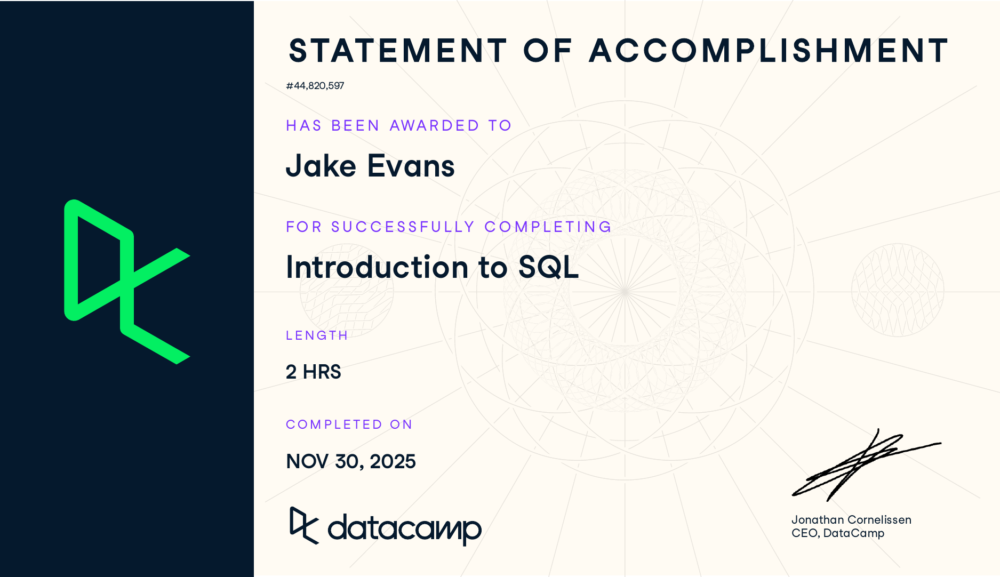

# Course-Completion Evidence

{fig-alt="DataCamp Statement of Accomplishment awarded to Jake Evans for completing Introduction to SQL on November 30, 2025" width="85%"}

I completed the DataCamp course *Introduction to SQL* on November 30, 2025. The course is marked as **Completed** under the Introduction to SQL assignment in the IBM 6500 DataCamp classroom.

# Learning Notes and Key Takeaways

The course is split into two chapters. Chapter 1 explains how relational databases are organized, while Chapter 2 focuses on how to write queries and pull information from them. Most of the course examples use a small library database with `books`, `patrons`, and `checkouts` tables, and some of the Chapter 2 videos also use an `employees` table. I used the library tables for my examples below.

| Table     | Example fields                                  |
|-----------|-------------------------------------------------|
| `books`   | `id`, `title`, `author`, `year`, `genre`        |
| `patrons` | `card_num`, `name`, `member_year`, `total_fine` |

: Library database used in the course examples

## Relational Databases

### Main ideas

A **relational database** stores data in separate tables and connects those tables through shared fields. Instead of putting everything into one giant spreadsheet, the information is split up based on what it represents, such as books, patrons, or checkouts. This helps keep the data organized, avoids repeating the same information, and makes it easier to keep everything accurate.

Databases can look a lot like spreadsheets, but they are much more powerful. They can handle much larger amounts of data and can also be more secure through things like encryption. Multiple people can query the same database at the same time without changing the original data. The database simply pulls and displays the information based on what the query asks for.

Key vocabulary:

- **Table:** stores data about one type of thing using rows and columns.
- **Record (row):** one individual entry, such as one book or one patron.
- **Field (column):** one type of information recorded for each entry, such as `title` or `member_year`.
- **Unique identifier (key):** a value used to identify each record, such as a patron's `card_num`. Names are not great keys because more than one person can have the same name.
- **Schema:** the overall structure or "blueprint" of the database. It shows the tables, the fields they contain, their data types, and how the tables connect to each other.
- **Server:** the computer where the database is stored and where requests for the data are handled. This allows multiple people to access the same database.

**Naming conventions.** Table names should be clear about the data they contain, lowercase, and use underscores instead of spaces, such as `patrons` or `book_checkouts`. Field names follow the same lowercase and underscore rules, but should be singular because each field refers to the information for a single record. That is why the patrons table uses `card_num` and `name` instead of `card_nums` and `names`. Two fields in the same table cannot have the same name, and a field should never share a name with its table, so it is always clear whether a field or a table is being referred to.

**Data types.** Each field has a specific data type that controls what kind of information can be stored in it.

| Data type          | Stores                | Example        |
|--------------------|-----------------------|----------------|
| String (`VARCHAR`) | Text                  | `'Jake Evans'` |
| Integer (`INT`)    | Whole numbers         | `2025`         |
| Float (`NUMERIC`)  | Numbers with decimals | `2.50`         |

: Common data types

### Important SQL syntax

| Concept                    | Syntax / term              |
|----------------------------|----------------------------|
| Choose fields from a table | `SELECT field FROM table;` |
| Text data type             | `VARCHAR`                  |
| Whole number data type     | `INT`                      |
| Decimal data type          | `NUMERIC` / float          |
| End a statement            | `;`                        |

### Example

The course does not teach the syntax for creating tables, but it explains that when a table is created, each field is named and given a data type. This example shows what the `patrons` table's design would look like, based on the data types covered in the chapter.

``` sql
CREATE TABLE patrons (
    card_num     INT,       -- unique identifier
    name         VARCHAR,
    member_year  INT,
    total_fine   NUMERIC
);
```

### Explanation of the example

This defines a table called `patrons` with four fields. `card_num` is the unique identifier, so every patron has their own value, and it is an integer because card numbers are whole numbers. `name` is a `VARCHAR` because names are strings, and `VARCHAR` can hold short or long text. `member_year` is an `INT` because years are whole numbers. `total_fine` is `NUMERIC` because fines, like Jasmin's \$2.05, include a decimal. The field names are lowercase, singular, and do not share a name with the table.

### CEP application

For my CEP group's work with the Collins College of Hospitality Management, our campaign data will come from several places, including GA4, social platform analytics, and a survey. I can think of each source as its own table with a clear key, such as a session ID, post ID, or survey response ID. Keeping the field names and data types consistent should make it much easier to combine the data later. It also helps me understand the schema before I start querying anything, since I can see which fields connect one table to another.

## Querying

### Main ideas

A **query** is basically a request for specific data from a database. Most queries start with `SELECT`, which tells SQL which fields you want to return, and then `FROM`, which tells it which table to pull the data from. **Keywords** are the reserved words that tell SQL what action to perform. They are usually written in uppercase, while field and table names are written in lowercase, which makes the query easier to read. Queries should also end with a semicolon. The rows returned by a query are called the **result set**.

The chapter also covered a few ways to control what the final results look like:

- **`DISTINCT`** removes duplicates so each value, or combination of values, only appears once.
- **Aliasing (`AS`)** gives a field a different name in the results without changing the actual table.
- **Views (`CREATE VIEW`)** save a query so it can be reused later almost like a table. A view is considered a *virtual table* because SQL saves the query instead of making a separate copy of the data, so the results are always up to date. Creating a view does not return a result set. It just saves the query so I can select from it later.
- **Limiting results** only returns a certain number of rows, which is useful when you just want to preview a large table. It is also helpful when testing code, since some result sets can have thousands of rows. It is best to test a query on just a few results first and then remove the limit for the final version.

**SQL flavors.** Different versions of SQL follow the same general ANSI and ISO standards, so most basic commands work the same way. The main differences come from extra features or slightly different syntax. The course focused on **PostgreSQL**, which is free and open source, and **SQL Server**, which is made by Microsoft and uses T-SQL. One easy difference to see is how each one limits results. PostgreSQL uses `LIMIT` at the end of the query, while SQL Server uses `TOP` right after `SELECT`. The name PostgreSQL refers to both the database system and the SQL flavor used with it. The course also pointed out that the differences between flavors are pretty minor, so learning the fundamentals in one flavor makes it easy to pick up another by learning just a few extra keywords.

### Important SQL syntax

| Purpose                   | Syntax                                 |
|---------------------------|----------------------------------------|
| Select one or more fields | `SELECT field1, field2 FROM table;`    |
| Select all fields         | `SELECT * FROM table;`                 |
| Unique values only        | `SELECT DISTINCT field FROM table;`    |
| Rename a result field     | `SELECT field AS new_name FROM table;` |
| Save a query as a view    | `CREATE VIEW view_name AS SELECT ...;` |
| Limit rows (PostgreSQL)   | `SELECT field FROM table LIMIT 10;`    |
| Limit rows (SQL Server)   | `SELECT TOP(10) field FROM table;`     |

### Examples

**Selecting fields**

``` sql
SELECT title, author
FROM books;
```

This returns the title and author for every book in the `books` table. Other fields like `year` and `genre` are not included in the results.

**Returning unique values**

``` sql
SELECT DISTINCT author, genre
FROM books;
```

This returns each unique author and genre combination. For example, George R. R. Martin has more than one Fiction book in the table, but the George R. R. Martin and Fiction combination would only show once. If an author had both Fiction and Non Fiction books, each combination would appear as its own row.

**Aliasing**

``` sql
SELECT DISTINCT genre AS unique_genres
FROM books;
```

This returns a list of genres without duplicates and renames the result column `unique_genres`. This only changes how the result is displayed and does not change anything in the original `books` table.

**Saving a view**

``` sql
CREATE VIEW library_authors AS
SELECT DISTINCT author AS unique_author
FROM books;

SELECT *
FROM library_authors;
```

The first statement saves the query as a view called `library_authors`. The second statement lets me query that view the same way I would query a regular table. Since the view saves the query instead of saving a separate copy of the results, any new authors added to `books` will also appear the next time the view is queried.

**Limiting results in two flavors**

``` sql
-- PostgreSQL
SELECT genre
FROM books
LIMIT 10;

-- SQL Server (T-SQL)
SELECT TOP(10) genre
FROM books;
```

Both queries return the `genre` from only the first 10 rows. They do the same thing, but PostgreSQL puts `LIMIT` at the end of the query, while SQL Server puts `TOP` right after `SELECT`. Any line that starts with `--` is a comment, so SQL ignores it.

### CEP application

These are probably the commands I will use the most when I start pulling data for analysis. My part of the CEP, AO4, looks at which digital channels and content themes do the most to build awareness and generate inquiries from prospective students. A few ways I could use these commands are:

- `SELECT DISTINCT` could show every traffic source or campaign name that appears in the data. This would make it easier to catch inconsistent labels, like "Instagram" and "instagram", before I start grouping the data.
- Aliasing can make exported columns easier to read in charts and tables, such as changing `session_source` to `channel`.
- A view could save one standard campaign sessions query so everyone in my group is using the same definition of the data instead of writing slightly different versions.
- `LIMIT` would let me quickly preview a large dataset before running a bigger query.

Knowing that SQL flavors are different will also matter later because the upcoming BigQuery course uses Google's version of SQL, which is also where GA4 data can be exported.

# Overall Reflection and Future Reference

**Most useful skills.** The most useful part for me was learning how to understand the structure of a database before I start querying it. Being able to identify the tables, keys, and data types first makes the rest much easier. The basic `SELECT ... FROM` structure, along with `DISTINCT` and aliasing, also seems like something I will use constantly when pulling clean data from a larger dataset.

**Most challenging concepts.** Views probably took the most time for me to understand because they act like a table even though they do not actually store their own copy of the data. I also had to keep reminding myself which SQL flavor uses `LIMIT` and which one uses `TOP`. Another thing that could be easy to mess up is remembering that `DISTINCT` with two fields returns unique combinations of those fields, not separate unique values from each one.

**How SQL supports marketing analytics and the CEP.** A lot of marketing data comes from sources like web analytics, CRM systems, transactions, and surveys, and that information is usually stored in tables. SQL gives me a way to pull exactly what I need instead of only relying on dashboards or premade exports. For the CEP, this should make it easier to pull GA4 and campaign data by channel and then bring that data into R for analysis.

**What I expect to review again.** I will probably need to review views, the differences between SQL flavors, and naming and data type conventions when I start working with new databases. I also expect to build on these basics later with filtering, sorting, and aggregation in Intermediate SQL.

# Appendix: Publication Links

- [GitHub Repository](https://github.com/jakevns/IBM6500/tree/main/ibm-6500-sql-learning-portfolio)
- [Published Introduction to SQL Report](https://jakevns.github.io/IBM6500/ibm-6500-sql-learning-portfolio/docs/introduction-to-sql.html)
- [SQL Learning Portfolio Landing Page](https://jakevns.github.io/IBM6500/ibm-6500-sql-learning-portfolio/docs/index.html)
